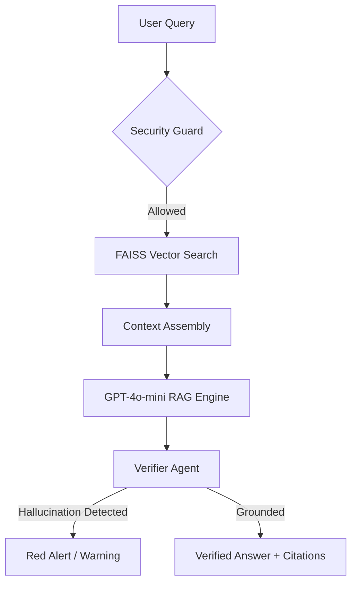

# 🧠 Zero-Hallucination RAG Console

> **A Production-Ready, Multi-Agent Research Framework for High-Stakes Biblical Analysis.**

[](https://www.python.org/)
[](https://streamlit.io/)
[](https://openai.com/)
[](https://github.com/facebookresearch/faiss)

This project demonstrates a **high-fidelity Retrieval-Augmented Generation (RAG)** system designed for domains where accuracy is non-negotiable. By combining a deep-dark **Premium Research Interface** with a strict **Multi-Agent Verification Loop**, the system ensures every claim is grounded in the source text, effectively eliminating hallucinations.

---

## 🛡️ The "Zero-Hallucination" Guard
Unlike standard RAG apps, this system employs a dual-layer defense strategy to ensure truthfulness:

### 1. The Retrieval Gate (Layer 1)
The primary RAG engine is forbidden from using its training data. It is constrained to a **FAISS Vector Index** containing the 7,200+ verses of the Bible. If information isn't in the context, the system is hard-coded to refuse the answer.

### 2. The Verifier Agent (Layer 2)
A dedicated **Audit Agent** intercept’s every generated response. It performs a claim extraction and cross-references each claim against the retrieved verses. 
*   **Green Badge (90%+):** Perfectly grounded.
*   **Amber Badge (50-80%):** Partial verification.
*   **Red Badge (<50%):** **Verification Failed**—The system proactively warns the user of an hallucination risk.

---

## 📊 Performance Benchmarks
We ran rigorous empirical evaluations comparing retrieval size ($k$) against hallucination rates.

| Metric | k=3 | k=5 | k=10 | k=15 (Optimal) |
| :--- | :--- | :--- | :--- | :--- |
| **Grounding Rate** | 81.1% | 82.1% | 88.7% | **89.0%** |
| **Hallucination Risk** | 18.9% | 17.9% | 11.3% | **11.0%** |
| **Avg. Latency** | 3.6s | 3.7s | 4.1s | 3.8s |

*Full results can be found in [evaluation/BASELINE_RESULTS.md](evaluation/BASELINE_RESULTS.md).*

---

## 🛠️ Tech Stack & Security
Designed for scalability and cost-efficiency:
*   **Engine**: `GPT-4o-mini` (High-speed, low-cost reasoning).
*   **Embeddings**: `MiniLM-L6` (Lightweight semantic search).
*   **Vector Store**: `FAISS` (Industrial-grade local indexing).
*   **Security**: 
    *   **SHA-256 Auth**: Persistent user registration and secure logins.
    *   **Persistence Rate-Limiting**: Strictly 10 tokens/hour per user to protect API budget.
    *   **Input Sanitization**: Multi-stage XSS and injection protection.

---

## 🚀 Quick Start

1. **Clone & Install**
   ```bash
   git clone https://github.com/JoelJoyston0705/Zero-Hallucination-RAG.git
   cd Bible_RAG
   pip install -r requirements.txt
   ```

2. **Configure API Key**
   Create a `.env` file and add:
   ```env
   OPENAI_API_KEY=your_key_here
   ```

3. **Initialize & Run**
   ```bash
   python setup.py
   streamlit run app.py
   ```

---

## 📐 Architecture Overview


---

## 🎓 Research Applications
While this project focuses on the Bible as a controlled dataset, the methodology is applicable to:
*   **Legal RAG**: Statutory interpretation with zero drift.
*   **Medical RAG**: Guideline-based research with graded evidence.
*   **Enterprise AI**: Internal policy consoles with absolute cite-ability.

---

<div align="center">
  <b>Built for Truth. Built for Trust.</b><br>
  <i>A domain-constrained research ecosystem.</i>
</div>
